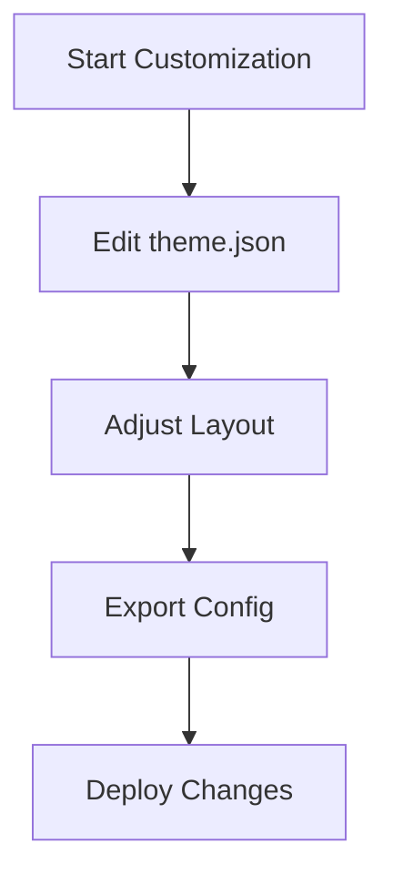

## Overview

Customize your Evgeniy Popenko Documentation space to match your brand and workflow. Adjust themes, colors, layouts, and settings through simple configuration files. Start with the brand color `#3B82F6` for a professional blue accent, then explore advanced options.

<Columns cols={3}>
  <Card title="Theme & Colors" icon="palette" href="#theme-colors">
    Set primary colors and dark mode preferences.
  </Card>
  <Card title="Layout Adjustments" icon="layout" href="#layout">
    Modify sidebar, navigation, and responsive behavior.
  </Card>
  <Card title="Export/Import" icon="download" href="#export-import">
    Backup and restore your custom settings.
  </Card>
</Columns>

## Theme and Color Options

Tailor the visual identity to align with your project. Edit the `theme.json` file in your documentation root.

<Steps>
  <Step title="Locate Config" icon="search">
    Navigate to your project root and open `config/theme.json`.
  </Step>
  <Step title="Update Colors" icon="edit-3">
    Set your primary color and accents.
  </Step>
  <Step title="Apply Changes" icon="refresh-cw">
    Restart your dev server with `npm run dev`.
  </Step>
</Steps>

<CodeGroup tabs="JSON,YAML">
```json
{
  "primaryColor": "#3B82F6",
  "secondaryColor": "#1E40AF",
  "darkMode": true,
  "fontFamily": "Inter, sans-serif"
}
```
```yaml
primaryColor: "#3B82F6"
secondaryColor: "#1E40AF"
darkMode: true
fontFamily: "Inter, sans-serif"
```
</CodeGroup>

<Callout kind="tip">
  Test color contrast with tools like WebAIM Contrast Checker to ensure accessibility.
</Callout>

## Layout Adjustments

Fine-tune the structure for better navigation. Use `layout.tsx` or environment variables.

<Tabs>
  <Tab title="Sidebar Layout" icon="sidebar">
    Enable collapsible sidebar for dense content.

    ```tsx
    // config/layout.tsx
    export const sidebarConfig = {
      collapsible: true,
      defaultOpen: ['overview', 'api']
    };
    ```

    Adjust width with CSS:

    ```css
    .sidebar {
      width: 280px;
    }
    ```
  </Tab>
  <Tab title="Full-Width Mode" icon="maximize-2">
    Remove sidebars for wide screens.

    ```tsx
    // Enable via env
    process.env.FULL_WIDTH = 'true';
    ```
  </Tab>
</Tabs>

| Layout Option | Config Key | Default Value |
|---------------|------------|---------------|
| Collapsible Sidebar | `sidebar.collapsible` | `false` |
| Search Bar | `header.search` | `true` |
| Footer Links | `footer.links` | `[]` |

## Export and Import Settings

Backup your customizations to share or version control them.

<Expandable title="Export Steps" default-open="true">
  1. Run `npm run export-config` to generate `custom-config.zip`.
  2. Includes `theme.json`, `layout.tsx`, and assets.
</Expandable>

<Expandable title="Import Steps">
  1. Unzip `custom-config.zip` to project root.
  2. Run `npm run import-config`.
  3. Restart server.
</Expandable>

<Callout kind="alert">
  Always commit configs to Git, but exclude sensitive data like API keys (`YOUR_API_KEY`).
</Callout>

## Advanced Customizations

For deeper changes, override components in `components/overrides/`.

```javascript
// Example: Custom Header
// components/overrides/Header.tsx
import { Header } from '@evgeniy-popenko/docs';

export default function CustomHeader() {
  return <Header brandColor="#3B82F6" />;
}
```

These adjustments make your documentation space uniquely yours. Experiment in a dev environment first.

