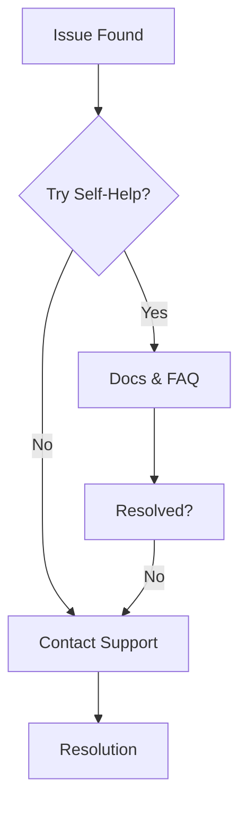

## Troubleshooting Access Issues

Access problems often stem from authentication or permission settings. Follow these steps to resolve common issues.

<Steps>
  <Step title="Verify Your Credentials" icon="user">
    Check your email and password. Ensure you use the correct account associated with your invitation.
  </Step>
  <Step title="Reset Password" icon="key">
    Navigate to the login page and select "Forgot Password?". Enter your email to receive a reset link.
  </Step>
  <Step title="Check Permissions" icon="shield">
    Contact your workspace admin to confirm your role. Admins can adjust permissions via the members settings.
  </Step>
  <Step title="Clear Browser Cache" icon="trash-2">
    Clear your browser cache and cookies, then log in again. Use incognito mode to test.
  </Step>
</Steps>

<Callout kind="tip">
  If issues persist after these steps, note your browser version and error message for support.
</Callout>

## Best Practices for Organization

Organize your documentation effectively to improve collaboration and navigation.

<Tabs>
  <Tab title="Small Teams" icon="users">
    Use simple folders for projects.

    ```bash
    mkdir docs/projects
    mkdir docs/api
    mkdir docs/guides
    ```

    Limit nesting to two levels to avoid confusion.
  </Tab>
  <Tab title="Large Teams" icon="building">
    Implement tags and search optimization.

    <CodeGroup tabs="Markdown,JSON">
    ```markdown
    ---
    tags: ["api", "v1.2", "internal"]
    ---

    # API Endpoint
    ```
    ```json
    {
      "tags": ["api", "v1.2", "internal"],
      "search_keywords": ["endpoint", "auth"]
    }
    ```
    </CodeGroup>
  </Tab>
</Tabs>

<Callout kind="info">
  Always use consistent naming conventions, like `{kebab-case}` for file names.
</Callout>

<ExpandableGroup>
  <Expandable title="Advanced Tagging System" default-open="false">
    Create a tag hierarchy: `category/subcategory`. For example, `api/auth` or `guides/onboarding`.

    This enables filtered searches across your documentation space.
  </Expandable>
</ExpandableGroup>

## Support Resources

Access help quickly through these channels.

<Columns cols={3}>
  <Card title="Official Docs" icon="book-open" href="/docs/introduction">
    Comprehensive guides and API references.
  </Card>
  <Card title="Community Forum" icon="message-circle" href="https://forum.example.com" target="_blank">
    Ask questions and share solutions.
  </Card>
  <Card title="Email Support" icon="mail" href="mailto:support@example.com">
    Direct assistance for premium users.
  </Card>
</Columns>



For urgent issues, prioritize the community forum where peers respond quickly. Premium plans include 24/7 email support. Review your plan settings to upgrade if needed.