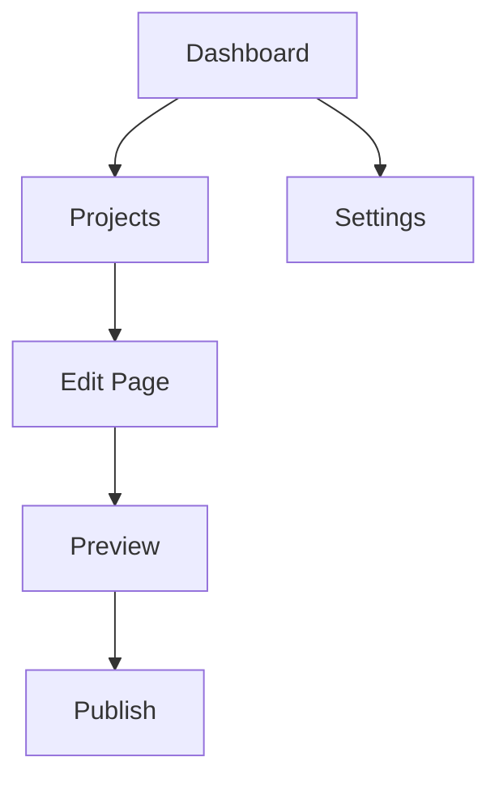

## Overview

Set up your Evgeniy Popenko Documentation space quickly and start organizing project docs. This guide walks you through account creation, your first project, and essential navigation. You complete setup in under 5 minutes and publish your first page immediately.

<Callout kind="tip">
  Use your brand color `{#3B82F6}` in custom themes for a consistent look across all docs.
</Callout>

## Account Setup

Create your account to access the documentation platform.

<Steps>
  <Step title="Sign Up" icon="user-plus">
    Visit the login page and select **Sign Up**. Enter your email and create a strong password.
    
    Enable two-factor authentication for security.
  </Step>
  
  <Step title="Verify Email" icon="mail">
    Check your inbox for the verification link. Click it to activate your account.
    
    <CodeGroup tabs="Web,CLI">
      ```bash
      # Optional: Use CLI for verification
      evgeniy-docs verify --email your-email@example.com
      ```
      ```javascript
      // Node.js script example
      const EvgeniyDocs = require('evgeniy-docs-sdk');
      const client = new EvgeniyDocs({ apiKey: 'YOUR_API_KEY' });
      await client.verifyEmail('your-email@example.com');
      ```
    </CodeGroup>
  </Step>
  
  <Step title="Set Profile" icon="settings">
    Add your name, avatar, and default brand color `{#3B82F6}` in profile settings.
  </Step>
</Steps>

## Create Your First Project

Launch a new documentation space for your project.

<Tabs>
  <Tab title="Dashboard" icon="layout">
    From the dashboard, click **New Project**. Enter a name like "MyApp Docs" and select a template.
    
    Choose MDX for rich components or Markdown for simplicity.
  </Tab>
  
  <Tab title="CLI" icon="terminal">
    Install the CLI tool and initialize.
    
    ```bash
    npm install -g @evgeniy/docs-cli
    evgeniy-docs init my-project --template mdx
    cd my-project
    evgeniy-docs serve
    ```
  </Tab>
</Tabs>

<Callout kind="success">
  Your project auto-deploys to a URL like `{https://my-project.evgeniy-docs.com}`.
</Callout>

## Basic Navigation

Master the interface to manage your docs efficiently.



| Section | Purpose | Key Actions |
|---------|---------|-------------|
| Dashboard | Overview | View projects, analytics |
| Projects | Management | Create, edit, delete |
| Pages | Content | Add MDX pages, frontmatter |
| Settings | Customization | Themes, domains, integrations |

<Columns cols={3}>
  <Card title="Explore Pages" icon="book-open" href="/docs/pages">
    Add and organize MDX content with components like `<Steps>` and `<Tabs>`.
  </Card>
  
  <Card title="Customize Theme" icon="palette" href="/docs/themes">
    Apply `{#3B82F6}` and custom styles.
  </Card>
  
  <Card title="Integrate APIs" icon="plug" href="/docs/integrations">
    Connect webhooks and auth with `YOUR_API_KEY`.
  </Card>
</Columns>

## Next Steps

<Expandable title="Advanced Configuration" default-open="false">
  Edit `{next.config.js}` for custom routing:
  
  ```javascript
  /** @type {import('next').NextConfig} */
  const nextConfig = {
    docs: {
      brandColor: '#3B82F6',
      nav: {
        items: [
          { title: 'Guide', href: '/guide' },
          { title: 'API', href: '/api' }
        ]
      }
    }
  };
  
  module.exports = nextConfig;
  ```
</Expandable>

Publish your first page now and invite collaborators. Your documentation space scales with your projects.